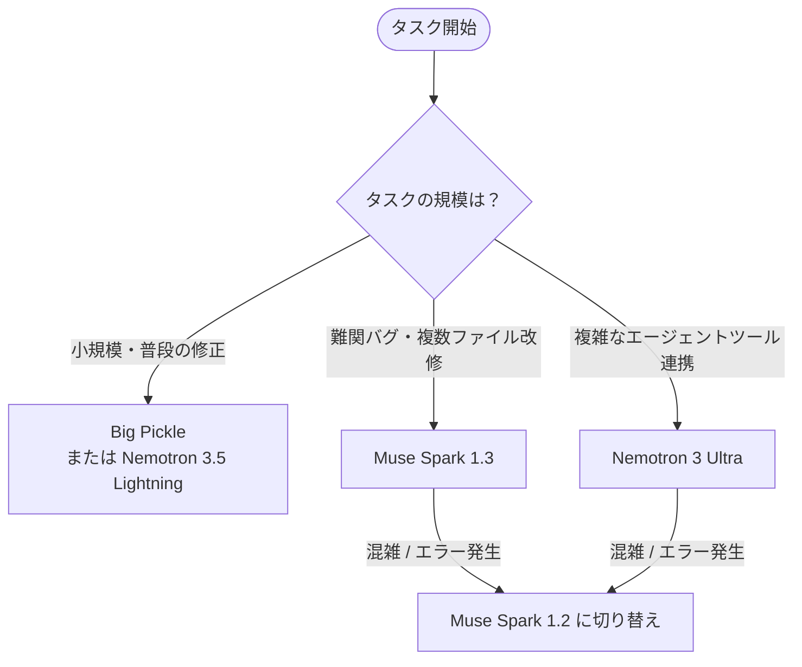

# OpenCodeで利用できる無料LLM 比較まとめガイド

AIコーディングエージェント「**OpenCode（sst/opencode）**」の公式ゲートウェイ（**OpenCode Zen**）および無料枠で現在利用可能なLLMモデルの性能、特徴、制限、使い分けの比較まとめです。

---

## 1. 無料モデル 総合比較表

> [!tip] **表のスクロール**
> Obsidian上では横スクロールで各項目の詳細を確認できます。

| モデル名 / モデルID | 開発元 / 構成 | 賢さ・推論力 | 特徴・得意タスク | コンテキスト長<br>(入力 / 最大出力) | 利用可能量・制限 | 応答速度 | プライバシー / データ扱い |
| :--- | :--- | :---: | :--- | :---: | :--- | :---: | :--- |
| **Big Pickle**<br>`big-pickle` | ステルスモデル<br>(GLM系派生と推測) | ★★★★☆ | **高速なリファクタリング＆デバッグ**<br>定番の標準無料枠。レスポンスが機敏で日常のスクリプト生成向き。 | 200K / 32K | **実質無制限**<br>(Go枠枯渇時のフォールバック先) | **高速** | ⚠️ **注意**<br>改善のため学習・保持の例外対象 |
| **Nemotron 3 Ultra Free**<br>`nemotron-3-ultra-free` | NVIDIA<br>(550B Mamba-MoE) | ★★★★★<br>(最上位) | **エージェント・長大コード推論**<br>多段階のツール実行・全体設計・リポジトリ構造の把握に極めて強力。 | **100万 (1M)** / 32K | 無料提供枠<br>(混雑時にレート制限や待機あり) | 中速〜高速<br>(MoE設計) | フィードバック収集用ログ |
| **Nemotron 3.5 Lightning Free**<br>`nemotron-3.5-lightning-free` | NVIDIA<br>(30B / 3B Active) | ★★★☆☆<br>〜 ★★★★☆ | **超高速フィードバック**<br>軽量で推論が速く、単体テスト作成や軽微なエラー修正の高速周回向け。 | 128K〜256K / 16K | 無料提供枠<br>(制限は比較的緩やか) | **爆速** | フィードバック収集用ログ |
| **Muse Spark 1.3 Contributor Free**<br>`muse-spark-1.3-contributor-free` | Meta<br>(Meta Superintelligence) | ★★★★★<br>(最上位) | **長期ワークフロー・指示厳守**<br>指示の脱落（ドリフト）が極めて少なく、大規模改修や慎重な実装に最適。 | **100万 (1M)** / 64K | 開発者貢献枠<br>(混雑時に制限・待機あり) | 高速〜普通<br>(思考プロセス有) | 開発貢献枠のためログ収集あり |
| **Muse Spark 1.2 Contributor Free**<br>`muse-spark-1.2-contributor-free` | Meta<br>(Meta Superintelligence) | ★★★★★<br>(準最上位) | **1.3の安定控え（バックアップ）**<br>基礎知能は1.3と同等。1.3が混雑している際のスムーズな迂回先。 | **100万 (1M)** / 64K | 開発者貢献枠<br>(1.3より比較的通りやすい) | 高速〜普通 | 開発貢献枠のためログ収集あり |
| **MiMo-V2.5 Free**<br>`mimo-v2.5-free` | Xiaomi<br>(Sparse MoE) | ★★★★☆ | **オムニモーダル・バランス型**<br>画像や設計書・ドキュメント解析を交えた実装に優れた適性。 | **100万 (1M)** / 32K | 無料提供枠 | 高速 | 無料利用規約に準拠 |
| **Ling 3.0 Flash Fin Free**<br>`ling-3.0-flash-fin-free` | Ling | ★★★☆☆ | **低遅延・シンプル作業**<br>即答性重視。シェルコマンド生成や単発の関数記述向き。 | 128K / 8K | 無料提供枠 | **最速クラス** | 無料利用規約に準拠 |

---

## 2. 主要モデルの詳細レビュー

### 🥒 Big Pickle (`big-pickle`)
- **長所**: 動作が軽く、OpenCodeの無料枠の中で最も安定して利用可能。日々のコード編集に十分な賢さ。
- **短所**: プロンプトにない変更を勝手に追加する傾向が時折ある。
- > [!warning] **データプライバシーの例外**
  > OpenCodeの通常規約（Zero-Retention）とは異なり、**Big Pickleはモデル学習・品質改善のためにデータが保持・利用される例外**が明記されています。機密コードや個人情報は避けてください。

### ⚡ Nemotron 3 Ultra Free (`nemotron-3-ultra-free`)
- **長所**: 550Bパラメータ規模による圧倒的な論理的思考力。ファイル作成・検索・コマンド実行などエージェントツールの呼び出し失敗が少ない。
- **短所**: 無料プロモーション提供のため、世界的なアクセス集中時に「Upstream error」やレート制限が発生しやすい。

### 🧠 Muse Spark 1.3 vs 1.2（Meta）

> [!note] **1.3 と 1.2 の違い**
> 1.3は2026年9月リリースの最新版で、1.2（8月版）からエージェントの実用性が向上しています。

| 項目 | Muse Spark 1.3 | Muse Spark 1.2 |
| :--- | :--- | :--- |
| **ツール呼び出し効率** | **最適化**（1.2比で約20%削減） | やや冗長（ステップ数が多め） |
| **指示の保持力** | **非常に高い**（長時間でもルールを忘れない） | 終盤で細かい制約が抜けやすい |
| **挙動傾向** | 曖昧なら「質問」する慎重派 | 自分で推測して進める積極派 |
| **混雑状況** | 最新人気のため**混雑しやすい** | 比較的空いていて**すぐ通る** |

---

## 3. 実践おすすめローテーション（使い分け）

OpenCodeはセッション中にいつでもモデルを切り替えられるため、以下のローテーションが最も快適です。



1. **基本のメイン**: **Muse Spark 1.3**（確実かつ賢い）
2. **混雑・エラー時の控え**: **Muse Spark 1.2**（安定して通る）
3. **テンポ重視の単発タスク**: **Big Pickle**（レスポンス最速・無制限感）
4. **全体設計・複雑リファクタ**: **Nemotron 3 Ultra**（1Mコンテキストで全体把握）

---

## 4. OpenCodeでの設定・切り替え方法

### ① セッション中に切り替える場合
OpenCodeのターミナル画面で以下のコマンドを入力し、対話メニューから選択します。
```bash
/models
```

### ② 設定ファイルでデフォルトを指定する場合
プロジェクトルートまたはグローバルの `opencode.json`（または `opencode.jsonc`）に記載します。

```jsonc
{
  "$schema": "https://opencode.ai/config.json",
  // デフォルトモデルの指定例
  "model": "opencode/muse-spark-1.3-contributor-free"
  
  // その他の候補:
  // "model": "opencode/muse-spark-1.2-contributor-free"
  // "model": "opencode/nemotron-3-ultra-free"
  // "model": "opencode/big-pickle"
}
```

